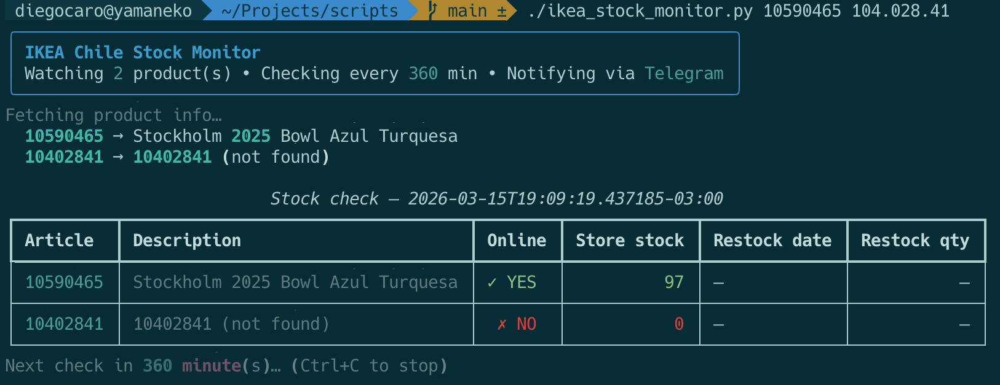

# Diego's scripts repo


Scripts for fun stuff, probably vibe-coded but supervised by me. One of my three cats approved the PRs.

All scripts use `uv` inline dependencies (I love them!).

See [CONTRIBUTING.md](CONTRIBUTING.md) for the project's philosophy and conventions.

## Fun stuff

| Script | Description | Screenshot |
|--------|-------------|------------|
| [`ikea_stock_monitor.py`](ikea_stock_monitor.py) | Monitors IKEA Chile product availability and sends Telegram notifications when items are back in stock. Supports continuous monitoring and single-check mode (for cron). |  |

## How to run the scripts

1. Install [uv](https://docs.astral.sh/uv/)
2. Run a script:

   ```bash
   uv run ikea_stock_monitor.py 30623912
   ```

   `uv` will automatically install the required dependencies on the first run.


## Team

